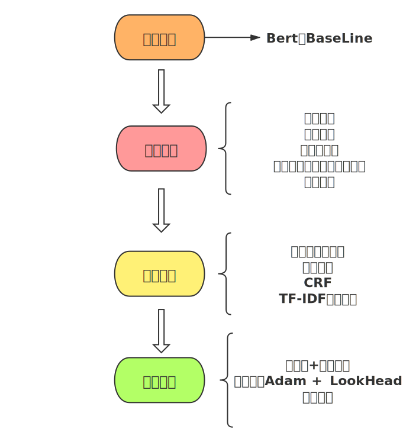
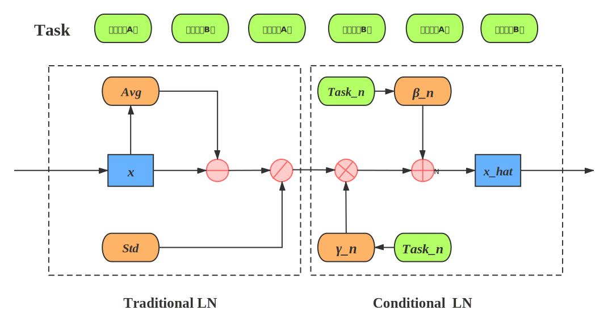

# 2021搜狐校园文本匹配算法大赛决赛第八名解决方案
## 队伍: 1801  决赛排名:8 
赛题链接:https://www.biendata.net/competition/sohu_2021/
## 设计思路  
### Model使用NEZHA-base做的单模单折 

### 1、模型选择  
我们选择了Bert为Baseline，在这里也要感谢苏神提供的[bert4keras](https://github.com/bojone/bert4keras).使用起来清晰简洁。

### 2、共享参数的情况下完成六分类： 

修改了LayerNorm的结构，调整了均值和方差

### 3、数据处理上我们尝试了以下方法:  

- 数据对偶(短短或长长使用)  P->Q  ==>  Q->P （效果不好）  
- 数据闭包  Q->P P->R  ==> Q->R (这里要注意区分0，1标签在传递过程中的变化)  （提升不是很明显）  
- 数据清洗  划分置信区间，使用BCE_loss对伪标签进行训练 （效果不明显）  
- 长度排序  计算文本长度后，进行排序，长度类似的文本尽可能的排在一起，同一个Batch时，padding计算有帮助 (效果有提升，速度加快)    

### 4、模型修改  

- 梯度惩罚（尝试了比FGM效果好，效果有提升）[参考文章](https://www.spaces.ac.cn/archives/7234)
- Lookahead（效果有提升）,论文来自 《Lookahead Optimizer: k steps forward, 1 step back》[代码地址](https://github.com/bojone/keras_lookahead)
- 划分阈值（解决类别不平衡，效果有提升）  
- 长文本处理-摘要提取，使用Snownlp提取多个摘要，并用TextRank计算最重要的摘要，尝试两种方案:

     - 对所有长文本摘要提取，并替换原文本（效果不好）

     - 只对短长B文本摘要提取，并替换原文本（效果变好，尤其是短长B，这么尝试的目的是因为短长B效果非常差）

     - 对长文本进行分段式切割，并进行交叉计算（短短，长长效果变好，短长变差）

   最后采用的后两种方法结合的方案

### 5、特征工程 

-  我们输出没有使用平均池化，而是使用TF-IDF计算的词权，进行按权池化  
-  Bert+CRF预处理（对BAD CASE进行分析可以发现很多时候效果不好是因为长句整体语义相同，但是主语或者地点不同，我们使用NER吧主语和地点当作一个新的token embedding加入）

### 6、改进方向

- 可以使用多个预训练模型融合,并采用知识蒸馏
- 增对句子结构的关注,Bert+CRF预处理的方法可玩性还很高
- 长文本的处理问题,大多数是直接截断,有些暴力
- 对比学习,文本匹配的问题可以将两段文本经过预训练得到Embedding后直接输入到对比学习框架中,优化Embedding

## End

很开心给大家分享我们的方案，有问题的地方欢迎大家指出，也希望大家彼此交流能够学到更多东西

